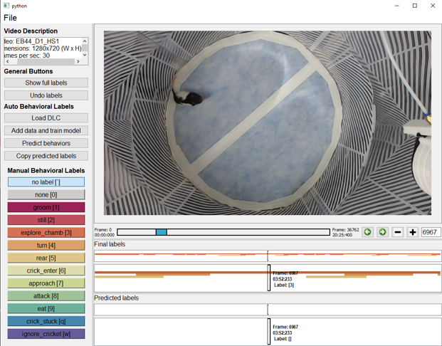

<div id="top"></div>


<!-- PROJECT SHIELDS -->

[![MIT License][license-shield]][license-url]
[![LinkedIn][linkedin-shield]][linkedin-url]


<!-- PROJECT LOGO -->
<br />
<div align="center">

  <h3 align="center">A python GUI for classifying behavior</h3>

</div>


<!-- TABLE OF CONTENTS -->
<details>
  <summary>Table of Contents</summary>
  <ol>
    <li>
      <a href="#how-it-looks">How It Looks</a>
    </li>
    <li>
      <a href="#getting-started">Getting Started</a>
    </li>
    <li><a href="#license">License</a></li>
    <li><a href="#contact">Contact</a></li>
    <li><a href="#acknowledgments">Acknowledgments</a></li>
  </ol>
</details>


<!-- ABOUT THE PROJECT -->
## How It Looks

Load in your video, manually classify behaviors, train ML to predict as you go.
<br />


<p align="right">(<a href="#top">back to top</a>)</p>


<!-- GETTING STARTED -->
## Getting Started

### Installation:

Create a new anaconda environment for this project with Python==3.9 (recommended)

Clone it directly from GitHub
```
git clone https://github.com/drbcary/BehCoder.git
```

Navigate to path where project was cloned. Install dependencies with pip.
```
pip install -r requirements.txt
```

Instructions for use located in word document tutorial.

Feel free to contact me at dr.bcary@gmail.com if you have questions.

<p align="right">(<a href="#top">back to top</a>)</p>


<!-- LICENSE -->
## License

BehCoder code is licensed under GNU General Public License 3 (GPL-3.0)

<p align="right">(<a href="#top">back to top</a>)</p>


<!-- CONTACT -->
## Contact

Brian Cary - dr.bcary@gmail.com

<p align="right">(<a href="#top">back to top</a>)</p>


<!-- ACKNOWLEDGMENTS -->
## Acknowledgments

Thanks to https://github.com/petered for creating video_reader.py ([vid_reader-url])


<p align="right">(<a href="#top">back to top</a>)</p>


<!-- MARKDOWN LINKS & IMAGES -->

[license-shield]: https://img.shields.io/github/license/github_username/repo_name.svg?style=for-the-badge
[license-url]: https://github.com/github_username/repo_name/blob/master/LICENSE.txt
[linkedin-shield]: https://img.shields.io/badge/-LinkedIn-black.svg?style=for-the-badge&logo=linkedin&colorB=555
[linkedin-url]: https://www.linkedin.com/in/brian-cary-39a631208/
[vid_reader-url]: https://gist.github.com/petered/db8e334c7aefdf367af1b11e6eefe733#file-video_reader-py
